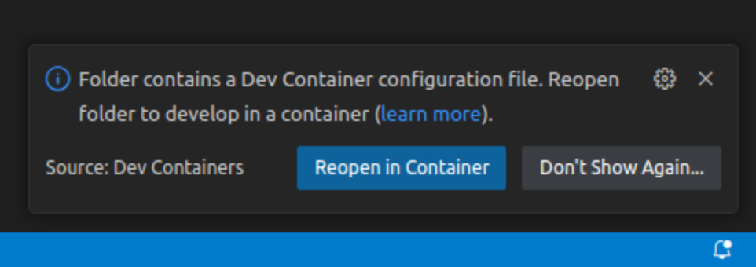
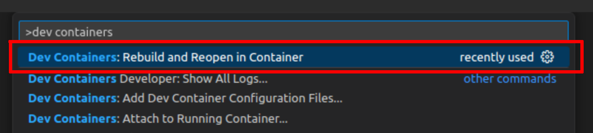
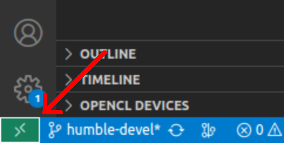
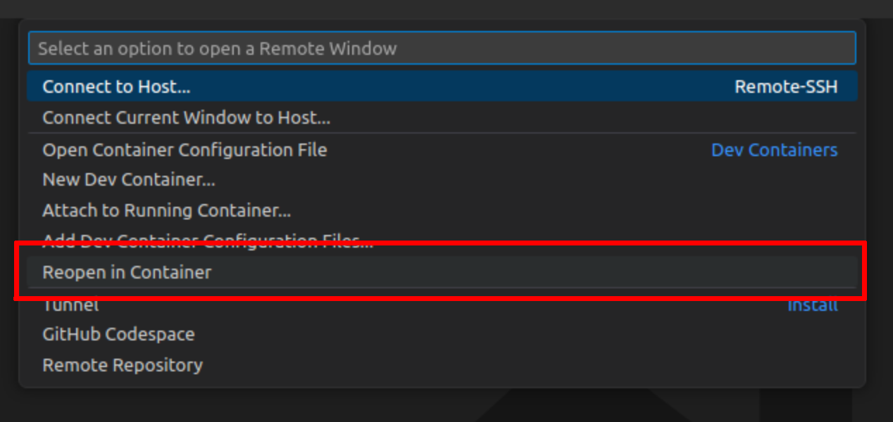
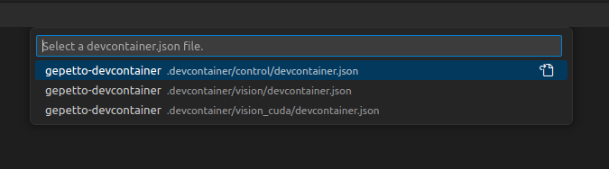

# Agimus devcontainer

Devcontainer setup for the AGIMUS project. It provides a devcontainer for ROS 2 Humble with predefined VS Code plugins and autocompletion for VS Code for C++ and Python, including ROS paths.

 This project consists of 4 prebuilt docker images:
 - `agimus_dev_container:humble-devel-base`: Common image with all the shared utils preinstalled.
 - `agimus_dev_container:humble-devel-control`: Image specialized for control and planning part of Agimus experiments. Extends base image with Ignition-Gazebo installation and custom libfranka for interaction with old Panda robot. Additionally it has prebuilt list of dependencies such as [Coal](https://github.com/coal-library/coal), [Pinocchio](https://github.com/stack-of-tasks/pinocchio), [Crocoddyl](https://github.com/loco-3d/crocoddyl) and [HPP](https://humanoid-path-planner.github.io/hpp-doc/) with a set of GUI tools like [Gepetto Viewer](https://github.com/Gepetto/gepetto-viewer). Everything is build with python bindings.
 - `agimus_dev_container:humble-devel-vision`: Image specialized for vision tasks of Agimus project. Has preinstalled [HappyPose](https://github.com/agimus-project/happypose) (Torch installation for CPU) and [PyM3T](https://github.com/agimus-project/pym3t) with their ROS nodes as well as [olt_ros2_pipeline](https://github.com/agimus-project/olt_ros2_pipeline.git) with dependencies. HappyPose comes with pre-downloaded models and weights for `tless` and `ycbv` datasets.
 - `agimus_dev_container:humble-devel-vision-cuda`: Image specialized for vision tasks of Agimus project. Consists of the same configuration as `humble-devel-vision` image, but [HappyPose](https://github.com/agimus-project/happypose) is installed with CUDA support.

 To choose between which docker to launch user will be prompted which configuration they want to launch. Available are `control`, `vision` and `vision_cuda`. In order to obtain full pipeline consisting of control and vision modules one has to launch two instances of VS Code. One with devcontainer launched for vision configuration and one with configuration for control.

## Usage

This repository is meant to be used in the same spirit as ROS workspaces. After downloading and launching devcontainer (for more information follow later steps) users can download repositories they wish to work on. When started, docker container creates bind mount between folder `/home/gepetto/ros2_ws/src` and folder of the downloaded repository. This way files within this directory will be accessible from host machine.

## Install docker and set up VS Code

To start the devcontainer first install Docker following this [guide](https://docs.docker.com/engine/install/ubuntu/).
Next, follow this [tutorial](https://docs.docker.com/engine/install/linux-postinstall/) on how to set up the access rights so `sudo` is no longer required to run docker.

If you have NVIDIA GPU and want to use it withing the container install [NVIDIA Container Toolkit](https://docs.nvidia.com/datacenter/cloud-native/container-toolkit/latest/install-guide.html).

And finally install the [Dev Containers](https://marketplace.visualstudio.com/items?itemName=ms-vscode-remote.remote-containers) extension in your VS Code.

## Start the devcontainer

You can start the dev container in several ways.

The simplest option is automatic. VS Code will show you, in the lower-right corner, a following window.

<div align="center">
  
</div>

The second option is by pressing `F1` and typing `Dev Containers` and selecting `Rebuild and Reopen in Container...` if you want to restart it or `Attach to Running Container...` if you would like to log it to as already started container.

<div align="center">
  
</div>

The last option starts by clicking the green square with arrows in the lower-left corner of the VS Code. And then in the new pop-up window, select `Reopen in Container`.

<div align="center">
  <p float="center">
    
    
  </p>
</div>

And then choose the container variant you want to launch.

<div align="center">
  
</div>

## Additional scripts

Inside of the the docker container in the directory `/home/gepetto/ros2_ws` two utility scripts can be sound.
[setup.sh](.devcontainer/setup.sh) used to invoke `rosdep install` with some defaults and [build.sh](.devcontainer/build.sh) used to invoke `colcon build`.

## GPU support for rendering

The dev container automatically sets up access to NVIDIA GPUs. Commands such as `nvidia-smi` are available and work as long as NVIDIA drivers and [NVIDIA Container Toolkit](https://docs.nvidia.com/datacenter/cloud-native/container-toolkit/latest/install-guide.html) are installed on the host system. For neural network inference and Gazebo rendering acceleration everything should be automatic.


## Working on miyanoura

Build the images:
```bash
docker build \
  -f ./.devcontainer/Dockerfile.base \
  --tag gitlab.laas.fr:4567/agimus-project/agimus_dev_container:humble-devel-base-miya \
  --build-arg CMAKE_BUILD_TYPE=Release \
  ./.devcontainer

docker build \
  -f ./.devcontainer/control/Dockerfile \
  --tag gitlab.laas.fr:4567/agimus-project/agimus_dev_container:humble-devel-control-miya \
  --build-arg AGIMUS_DOCKER_BASE_IMAGE=gitlab.laas.fr:4567/agimus-project/agimus_dev_container:humble-devel-base-miya \
  --build-arg nthreads=10 \
  ./.devcontainer/control
```

Then you should make sure that you use the docker image
**gitlab.laas.fr:4567/agimus-project/agimus_dev_container:humble-devel-control-miya**
and not
**gitlab.laas.fr:4567/agimus-project/agimus_dev_container:humble-devel-control**.


## Real time Docker image

Alongside dev-container this repository holds docker image for real time control `agimus_dev_container:humble-devel-realtime-control` to accompany the development image. This image is meant to container only minimal dependencies used by Panda robot and Linear Feedback Controller. It is meant to be launched in parallel with the developement container in cases where auxiliary computer for control is available.

## Demo compose.yaml

Demos can be run standalone without use of VSC and dev cotnainers. All that is required is access to docker on a machine. File [compose.yaml](./compose.yaml) contains minimal subset of privileges to run CPU-only demos. To launch the docker go to the directory where this repository is downloaded and run
```bash
docker compose up
```
Afterwards run
```
docker container exec -it agimus-demos-container bash
```
to log in to a bash shell to run demos. All the dependencies are prebuilt inside of the docker and there should be no need to rebuild packages internally in the running docker as long as they are not outdated. To launch demo simply run `ros2 launch agimus_demo<numer and name> bringup.launch`. Everything should be already preinstalled.
